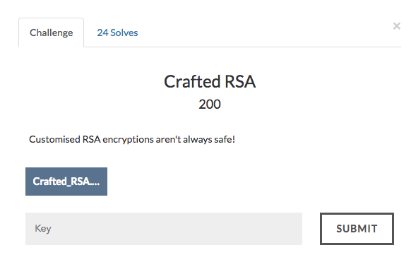

# Crafted RSA



Lets take a look at the encryption source code.

```
from Crypto.Util.number import *
from Crypto.PublicKey import RSA
import gmpy2
import random
from secret import num_size

seed = 0

def genPrime(sz):
    global seed
    while True:
        if seed == 0:
            pr = getPrime(sz)
            while size(pr) < 1024:
                pr *= getRandomNBitInteger(16)
            i = 2
            while i<1000 and size(pr)==1024:
                if isPrime(pr+i) and size(pr+i) == 1024:
                    seed = pr+i
                    return pr+i
                i += 1
        else:
            pr = seed + random.randint(2**100,2**300)
            if isPrime(pr) and size(pr) == 1024:
                seed = pr
                return pr

p = genPrime(num_size)
q = genPrime(num_size)
e = 2**16 + 1
phin = (p-1)*(q-1)
n = p*q

print "n: ", n
print "p: ", p
print "q: ", q

flag = open("flag.txt", 'r').read()
flag = int(flag.encode("hex"),16)

ciphertext = hex(pow(flag, e, n))[2:].replace("L","")
print ciphertext
obj1 = open("ciphertext.txt", 'w').write(ciphertext)
```

Looks like a prime generator function.For the first prime p , seed is equal to 0.

For q if you see they are adding a random integer to p.
This is the vulnerability.

While using RSA encryption, the difference between the primes should be atleast the square root of the lower prime.
That means
```
q - p > sqrt(p)
```
Otherwise the encryption will be vulnerable to fermat factorization attack.
We can see that p is in the range of 2^1024 and the difference between q and p is a random number between 2^100 and 2^300 . That means we can use fermat factorization to crack this encryption.

Full source code available [here](crack.py)
