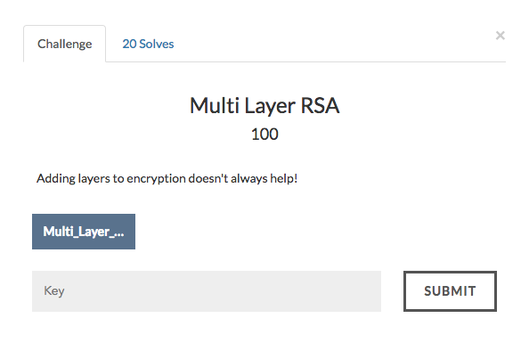

# MultiLayer RSA



Lets extract the given zip file.We are given a public RSA modulus(n) file and a ciphertext file.We are also given the source code of the encryption used.Let's take a look.

```
from Crypto.Util.number import *

flag = open("flag.txt").read()
flag = int(flag.encode("hex"),16)

p = getPrime(512)
q = getPrime(512)
n = p*q
phin = (p-1)*(q-1)

encryption_keys = [34961, 3617491, 68962801, 293200159531, 1191694878666066510321450623792489136756229172407332230462797663298426983932272792657383336660801913848162204216417540955677965706955404313949733712340714861638106185597684745174398501025724130404133569866642454996521744281284226124355987843894614599718553178595963014434904833]

for i in encryption_keys:
    assert GCD(i,phin) == 1

for i in encryption_keys:
    flag = pow(flag, i, n)

flag = hex(flag)[2:].replace("L","")

obj1 = open("ciphertext.txt",'w')
obj1.write(flag)
```

As the title and the code say, the flag is being encrypted multiple times with the same modulus but with a different public exponent.

This can be leveraged to our advantage.

From fermats little theorem, we know that
```
pow(m,n-1,n) = 1
```
Where m is the message and n is the modulus.

From the given code , we can infer that
```
flag = pow(message,e1*e2*e3*e4*e5,n)
```
Since pow(message,n-1,n) = 1,We can say that the new public exponent is
```
e = (e1*e2*e3*e4*e5)%(n-1)
```
We get
```
e = 3047442173541658754667464233797118324917469250436575767227172319344577259865313428705759330024959317716760816959590728238918140105663188172228696589411452947738069773833351725455888549656717874059636289036277785342126992626060696063089487811946920569580454880169977542532087635095357205433679009382368108273
```

It is known that for a significantly large public modulus , Wieners attack can be used to crack RSA.

I used an already online existing [script](wiener_attack.py) to execute wieners attack.

The final source code can be found [here](crack.py).
