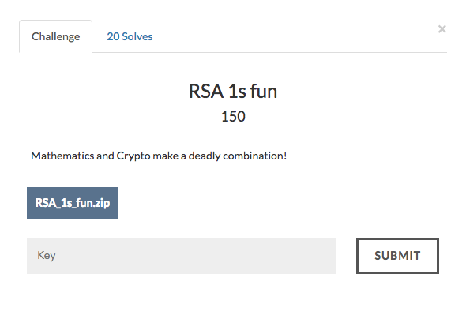

# RSA 1s Fun



The given source code is
```
from Crypto.Util.number import *

e1 = 9
e2 = 123

def prime_gen():
    while True:
        p = getPrime(1024)
        q = getPrime(1024)
        n = p*q
        phin = (p-1)*(q-1)
        if GCD(e1, phin) == 1 and GCD(e2, phin) == 1:
            return (p, q, n)
p, q, n = prime_gen()

print "p: ", p
print "q: ", q
print "n: ", n

flag = bytes_to_long(open("flag.txt").read().strip())
assert flag < n
assert flag**9 > n

c1 = pow(flag, e1, n)
c2 = pow(flag, e2, n)

print "c1: ", c1
print "c2: ", c2
```

If you observe carefully , he has explicitly mentioned that flag < n and flag**9 > n.

But it is not known to us whether flag**3 is less than or greater than n.

Now first lets think , why did he give two encrypted messages with two public exponents?
We know that 123/9 = 13 (Integer division) and 123%9=6 and 123 - 117 = 6.

=> 123 - (9) * 13 = 6

```
=> m**123/m**117 = m**6
=> m**123/(m**9)**13 = m**6
=> c2/c1**13 = m**6
```
Since we cannot divide those two numbers directly , we have to perform modular inverse.

```
import gmpy
c3 = (c2 * int(gmpy.invert(pow(c1,13,n),n)))%n
print c3
```
Now that we have m^6 and m^9 , we can get m^3 using the same method

```
c4 = (c1 * int(gmpy.invert(c3,n))) % n
```
Now lets see if a cube root exists for c4.
```
m0=gmpy.mpz(c4)
m0 = m0.root(3)
print int(m0[0])**3 == c4
```
Result is True.

Now lets convert m0 into a string.Voila , we have the flag now.

Full source available [here](crack.py).
