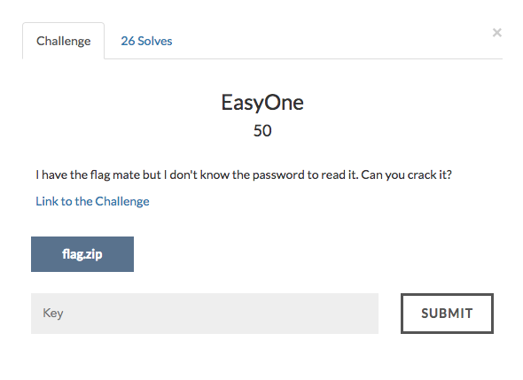
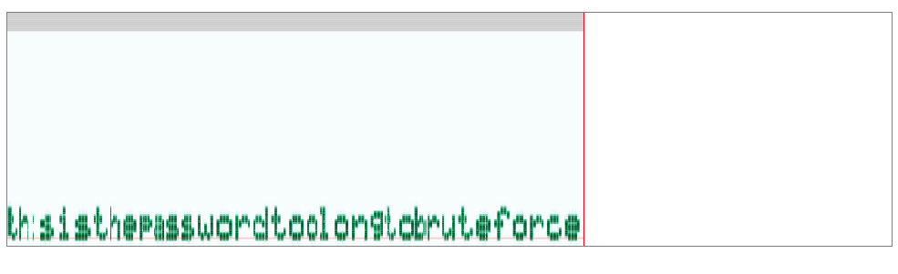

# Easy One



We are given a zip file and an .img file.
Looks like the zip file is password protected.
Maybe the password can be found from the .img file.

Lets extract the file using foremost.

```
$ foremost chal.img
```
We got a .wav file.
On listening to it , we can observe a morse code pattern. The morse code text can be extracted using
https://morsecode.scphillips.com/labs/decoder/ .

The extracted text is


Using this password to extract the zip file gives the flag.
