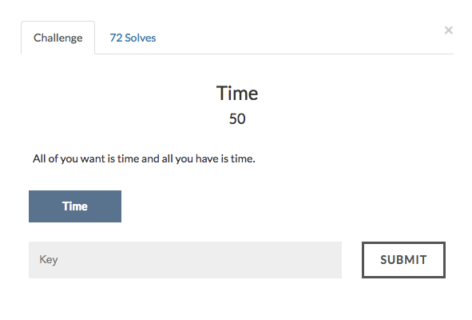

# Time



```
charlist = [110,105,100,115,97,124,83,111,54,116,88,38,116,88,109,82,116,115,88,115,111,52,88,69,52,96,110,105,73,110,105,96,122 ]

flag = ""
for i in charlist:
    flag += chr(i^7)

print flag

```
