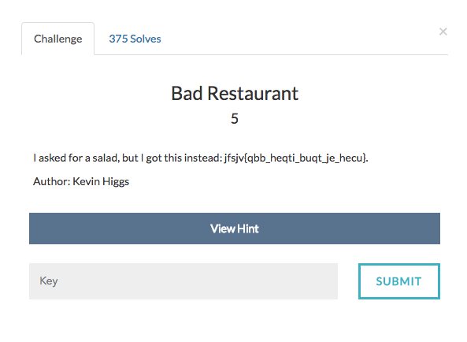

# Bad Restaurant

The decscription "salad" is hinting us that the cipher is Caesar Cipher(Caesar salad)

Since we know that the first 5 characters of the flag are tpctf , we get to know that the offset of the cipher is 10.
Now adding 10 to every alphabet in the string gives the flag.
