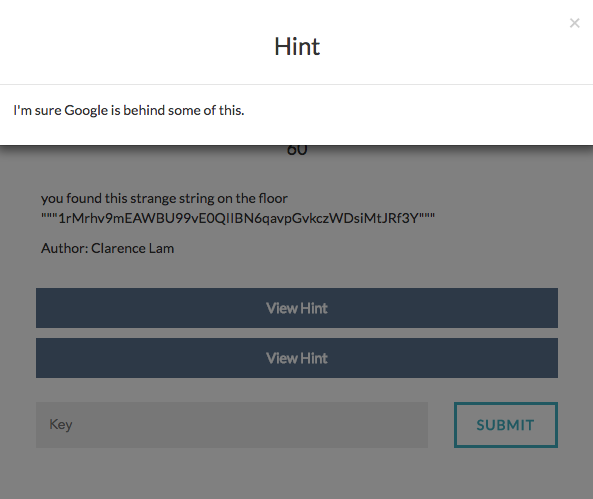

# Secret Doc




It says that the string given is something related to google.

If you have ever shared a file publicly  on google drive , you will observe that the given string is a part of the url of a publicly shared drive file.

Lets try to access it.
The url is [here](https://drive.google.com/file/d/1rMrhv9mEAWBU99vE0QIIBN6qavpGvkczWDsiMtJRf3Y/view).

In the document , you can see some hidden javascript text

``` javascript
//four ops
var add = function(a,b){return a+b;};
 ar sub = function(a,b){return a-b;};
var mul = function(a,b){return a*b;};
var div = function(a,b){return a/b;};
function str(a){return a toString();};
REGEXMATCH=(g,h)=> .test(h);
function mo (a,b){return a%b} / who needs semico ons
console.log(String.fromCharCode(+REGEXMAT H(/abc/,"qabcd")*79)) // THE QUICK BROWN FOX JU PS OVER THE LAZY DOGS
console.log(String.fromCharCode(+REGEXMATCH(/abc/,"abcd")*mul(6,8))) // the quick brown fox  umps over the lazy dogs
```


We can see that the code is broken.
Lets try to fix it.
By adding the following characters, the code is fixed => v.gd/lCMj
It looks like a URL.
Lets access it.
But after accessing , we see that the suffix of the link is not correct.
Lets try running the code.
We get
```
O
0
```
as output

Lets insert these characters into the url.
New URL is v.gd/lCOM0j


Lets access the given url.
We get a hexdump of a png file.
Lets download the png image.
But we see that the png is all black.
Maybe the flag is hidden?
Lets use stegsolve.
In one of the frames , after zooming in we can see the flag.

