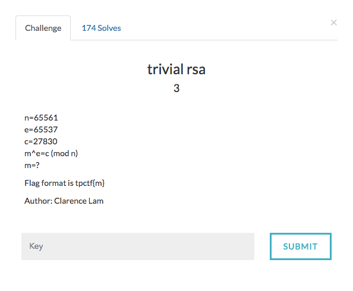

# Trivial RSA



This is a basic example of RSA cryptosystem.

For more info on RSA , please refer [RSA](https://en.wikipedia.org/wiki/RSA_(cryptosystem))

Using factordb.com to get the factors of n gives
```
65561 = 53 * 1237
```

Now we can use the following code to decrypt the cipher and get the flag

```
#From Wikibooks
def egcd(a, b):
    if a == 0:
        return (b, 0, 1)
    else:
        g, y, x = egcd(b % a, a)
        return (g, x - (b // a) * y, y)

def modinv(a, m):
    g, x, y = egcd(a, m)
    if g != 1:
        raise Exception('modular inverse does not exist')
    else:
        return x % m
n = 65561
e = 65537
c = 27830
p = 53
q = 1237
phi = (p - 1)*(q - 1)
d = modinv(e,phi)
m = pow(c,d,n)
print m
```
The flag is tpctf{m}
