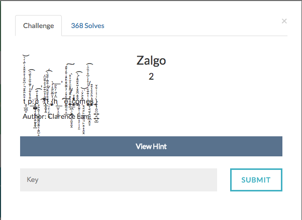

# Zalgo



You can see that the flag is present somewhere in the middle of all the gibberish text.
I used the following script to extract the flag.

```python
gibberishtext = "<copy gibberish and paste here>"
flag = ""
for char in gibberishtext:
  if ord(char) < 128:
    flag += char
print flag
```
