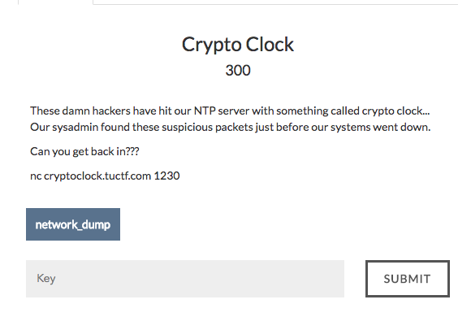
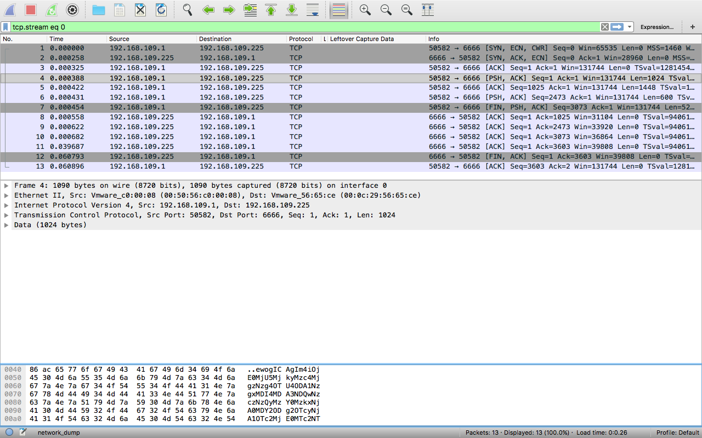

# Crypto Clock



Lets see what type of file is given
```
$ file network_dump
network_dump: pcap-ng capture file - version 1.0
```

Lets open the file in wireshark.

It appears that some base64 text was being sent while capturing.
On extracting and decoding the text , we get this
```
{
    "n":142592923782837889588057810280074407737423643916040668869726059762141765501708356840348112967723017380491537652089235085114921790608646587431612689308433796755742900776477504777927984318043841155548537514797656674327871309567995961808817111092091178333559727506289043092271411929507972666960139142195351097141,
    "e": 3
}
#!/usr/bin/env python

import sys
import random
import json
import arrow

big_1=44125640252420890531874960299151489144331823129767199713521591380666658119888039423611193245874268914543544757701212460841500066756559202618153643704131510144412854121922874915334989288095965983299150884589072558175944926880089918837606946144787884895502736057098445881755704071137014578861355153558L
big_2=66696868460135246134548422790675846019514082280010222055190431834695902320690870624800896599876321653748703472303898494328735060007496463688173184134683195070014971393479052888965363156438222430598115999221042866547813179681064777805881205219874282594291769479529691352248899548787766385840180279125343043041L


with open('flag') as f:
    flag = f.read()


with open('keys') as f:
    keys = json.load(f)

#now to get some randomness in here!
with open('/dev/urandom', 'rb') as f:
    rand = f.read(8)

rand_int = int(rand.encode('hex'),16)

#now lets use something easier.
random.seed(rand_int)

offset = random.randint(big_1,big_2)


while True:
    sys.stdout.write( '''Welcome to the ntp server
What would you like to do?
    1) get current time
    2) enter admin area
    3) exit
:''')
    sys.stdout.flush()
    response = raw_input('')
    if response == '1':
        time = arrow.utcnow().timestamp + offset
        enc_time = pow(time,keys['e'],keys['n'])
        sys.stdout.write('HAHAHAHAHAHA, this NTP server has been taken over by hackers!!!\n')
        sys.stdout.write('here is the time encrypted with sweet RSA!\n')
        sys.stdout.write(str(enc_time))
        sys.stdout.write('\n')
        sys.stdout.flush()
    elif response == '2':
        # lets get even more random!
        time = arrow.utcnow().timestamp + offset
        random.seed(time)
        guessing_int = random.randint(0,999999999999)
        sys.stdout.write('''ACCESS IS ONLY FOR TRUE HACKERS!
to prove you are a true hacker, predict the future:''')
        sys.stdout.flush()
        response = raw_input('')
        if response == str(guessing_int):
            sys.stdout.write('''Wow, guess you are a hacker.\n''')
            sys.stdout.write(flag)
            sys.stdout.write('\n')
            break
        else:
            sys.stdout.write('''I knew you weren't a hacker''')
            sys.stdout.write('\n')
            break
    else:
        print 'Good by.'
        break

```
This is the server code running at cryptoclock.tuctf.com:1230

It appears that we have to guess a number correctly to get the flag.Upon close observation on the code , we can observe a vulnerability in the process.
The same offset is being used everywhere.
If we can find the value of the offset, and calculate the seed using that offset, we will be able to guess the random number correctly.

Now we need to find the offset.For that we need to explore option 1 of the server code.

What is being done there is that a fixed offset is being added to the current timestamp and is being encrypted in RSA with the given keys.
```
n = 142592923782837889588057810280074407737423643916040668869726059762141765501708356840348112967723017380491537652089235085114921790608646587431612689308433796755742900776477504777927984318043841155548537514797656674327871309567995961808817111092091178333559727506289043092271411929507972666960139142195351097141
e = 3
```
Now at a particular timestamp , let the timestamp be t.
Let the message that is being encrypted be x.
```
x = t + offset
c1 = pow(x,e,n)
```
Now one second later, the message becomes x + 1 because t increases by 1.
```
c2 = pow(x+1,e,n)
```
Since we know both c1,c2 we can find out x from which we get the offset.
Now using currenttimestamp + offset as the seed for random function, we can guess the random number correctly.

I used this code to get the flag.
```
import random
import arrow
import sys
def prin(st):
    sys.stdout.write(st)
from pwn import *
def egcd(a, b):
    if a == 0:
        return (b, 0, 1)
    else:
        g, y, x = egcd(b % a, a)
        return (g, x - (b // a) * y, y)

def modinv(a, m):
    g, x, y = egcd(a, m)
    if g != 1:
        raise Exception('modular inverse does not exist')
    else:
        return x % m
N = 142592923782837889588057810280074407737423643916040668869726059762141765501708356840348112967723017380491537652089235085114921790608646587431612689308433796755742900776477504777927984318043841155548537514797656674327871309567995961808817111092091178333559727506289043092271411929507972666960139142195351097141
big_1=44125640252420890531874960299151489144331823129767199713521591380666658119888039423611193245874268914543544757701212460841500066756559202618153643704131510144412854121922874915334989288095965983299150884589072558175944926880089918837606946144787884895502736057098445881755704071137014578861355153558L
big_2=66696868460135246134548422790675846019514082280010222055190431834695902320690870624800896599876321653748703472303898494328735060007496463688173184134683195070014971393479052888965363156438222430598115999221042866547813179681064777805881205219874282594291769479529691352248899548787766385840180279125343043041L

r = remote("cryptoclock.tuctf.com",1230)
print r.recv(200)
r.sendline("1")
prin(r.recvline())
prin(r.recvline())
enctimestamp = int(r.recvline())
origtimestamp = arrow.utcnow().timestamp
print enctimestamp
enctimestamp1 = enctimestamp
while enctimestamp1 == enctimestamp:
    print r.recv(200)
    r.sendline("1")
    prin(r.recvline())
    prin(r.recvline())
    origtimestamp1 = arrow.utcnow().timestamp
    enctimestamp1 = int(r.recvline())
    print enctimestamp1
print (origtimestamp1 - origtimestamp)
assert (origtimestamp1 - origtimestamp) == 1
c1 = enctimestamp
c2 = enctimestamp1
nume = (c2 + 2*c1 - 1) % N
deno = (c2 - c1 + 2) % N
tsplusoffset = (nume * modinv(deno,N)) % N
offset = tsplusoffset - origtimestamp
print offset
prin(r.recv(200))
r.sendline("2")
prin(r.recv(200))
time = arrow.utcnow().timestamp + offset
random.seed(time)
guessing_int = random.randint(0,999999999999)
r.sendline(str(guessing_int))
print r.recv(300)

```
