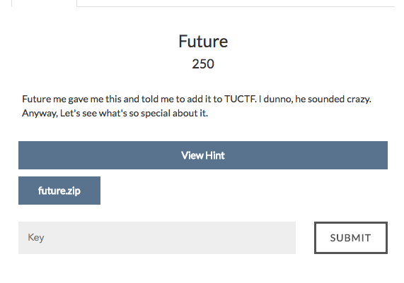

# Future



On extracting the zip file , we can find two files , one is a binary and the other is the source code of the binary.

Lets see the source code of the binary.
```
#include <stdio.h>
#include <string.h>
#include <stdlib.h>

void genMatrix(char mat[5][5], char str[]) {
	for (int i = 0; i < 25; i++) {
		int m = (i * 2) % 25;
		int f = (i * 7) % 25;
		mat[m/5][m%5] = str[f];
	}
}

void genAuthString(char mat[5][5], char auth[]) {
	auth[0] = mat[0][0] + mat[4][4];
	auth[1] = mat[2][1] + mat[0][2];
	auth[2] = mat[4][2] + mat[4][1];
	auth[3] = mat[1][3] + mat[3][1];
	auth[4] = mat[3][4] + mat[1][2];
	auth[5] = mat[1][0] + mat[2][3];
	auth[6] = mat[2][4] + mat[2][0];
	auth[7] = mat[3][3] + mat[3][2] + mat[0][3];
	auth[8] = mat[0][4] + mat[4][0] + mat[0][1];
	auth[9] = mat[3][3] + mat[2][0];
	auth[10] = mat[4][0] + mat[1][2];
	auth[11] = mat[0][4] + mat[4][1];
	auth[12] = mat[0][3] + mat[0][2];
	auth[13] = mat[3][0] + mat[2][0];
	auth[14] = mat[1][4] + mat[1][2];
	auth[15] = mat[4][3] + mat[2][3];
	auth[16] = mat[2][2] + mat[0][2];
	auth[17] = mat[1][1] + mat[4][1];
}

int main() {
	char flag[26];
	printf("What's the flag: ");
	scanf("%25s", flag);
	flag[25] = 0;

	if (strlen(flag) != 25) {
		puts("Try harder.");
		return 0;
	}


	// Setup matrix
	char mat[5][5];// Matrix for a jumbled string
	genMatrix(mat, flag);
	// Generate auth string
	char auth[19]; // The auth string they generate
	auth[18] = 0; // null byte
	genAuthString(mat, auth);
	char pass[19] = "\x8b\xce\xb0\x89\x7b\xb0\xb0\xee\xbf\x92\x65\x9d\x9a\x99\x99\x94\xad\xe4\x00";

	// Check the input
	if (!strcmp(pass, auth)) {
		puts("Yup thats the flag!");
	} else {
		puts("Nope. Try again.");
	}

	return 0;
}

```

Solving this is quite simple , just need to add the constraints in a z3 solver and get the solution.
The code I used is
```
from z3 import *
import sys
import re
password = "\x8b\xce\xb0\x89\x7b\xb0\xb0\xee\xbf\x92\x65\x9d\x9a\x99\x99\x94\xad\xe4"

s = Solver()

matrix = [ [ Int("x_%s_%s" % (i, j)) for j in range(5) ] for i in range(5) ]
s.add(ord(password[0]) == matrix[0][0] + matrix[4][4])
s.add(ord(password[1]) == matrix[2][1] + matrix[0][2])
s.add(ord(password[2]) == matrix[4][2] + matrix[4][1])
s.add(ord(password[3]) == matrix[1][3] + matrix[3][1])
s.add(ord(password[4]) == matrix[3][4] + matrix[1][2])
s.add(ord(password[5]) == matrix[1][0] + matrix[2][3])
s.add(ord(password[6]) == matrix[2][4] + matrix[2][0])
s.add(ord(password[7]) == matrix[3][3] + matrix[3][2] + matrix[0][3])
s.add(ord(password[8]) == matrix[0][4] + matrix[4][0] + matrix[0][1])
s.add(ord(password[9]) == matrix[3][3] + matrix[2][0])
s.add(ord(password[10]) == matrix[4][0] + matrix[1][2])
s.add(ord(password[11]) == matrix[0][4] + matrix[4][1])
s.add(ord(password[12]) == matrix[0][3] + matrix[0][2])
s.add(ord(password[13]) == matrix[3][0] + matrix[2][0])
s.add(ord(password[14]) == matrix[1][4] + matrix[1][2])
s.add(ord(password[15]) == matrix[4][3] + matrix[2][3])
s.add(ord(password[16]) == matrix[2][2] + matrix[0][2])
s.add(ord(password[17]) == matrix[1][1] + matrix[4][1])

for i in range(25):
    m = (i * 2) % 25
    f = (i * 7) % 25
    if f == 0:
        s.add(matrix[m/5][m%5] == ord("T"))
    if f == 1:
        s.add(matrix[m/5][m%5] == ord("U"))
    if f == 2:
        s.add(matrix[m/5][m%5] == ord("C"))
    if f == 3:
        s.add(matrix[m/5][m%5] == ord("T"))
    if f == 4:
        s.add(matrix[m/5][m%5] == ord("F"))
    if f == 5:
        s.add(matrix[m/5][m%5] == ord("{"))
    if f == 24:
        s.add(matrix[m/5][m%5] == ord("}"))

s.check()
#print s.model()
flag=[""]*25
matrix = []
for i in range(5):
    matrix.append([0]*5)
keylist = s.model().decls()
for i in range(25):
        indlist = re.findall(r'[0-9]+',str(keylist[i]))
        p = int(indlist[0])
        q = int(indlist[1])
        matrix[p][q] = int(str(s.model()[keylist[i]]))
for i in range(25):
    m = (i * 2) % 25
    f = (i * 7) % 25
    flag[f] = chr(matrix[m/5][m%5])
print "FLAG: ", "".join(flag)

```
The code doesn't seem to be clean . But it was the best I could do during the contest.
After getting the flag , you may need to check if the flag is correct by passing it to the binary.
