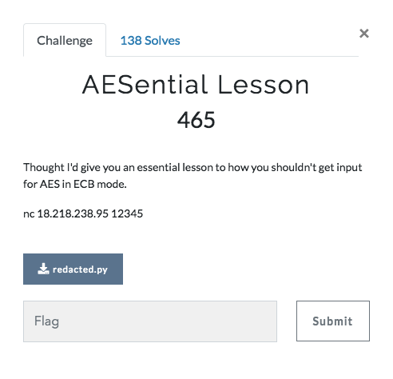

# AESential Lesson (Crypto 465 points)



Source code: [redacted.py](redacted.py)

From the heading, it is obvious that we are presented with a problem related to AES-ECB encryption.

## AES ECB
ECB(Electronic Code Book) is a mode of operation of AES Encryption. The disadvantage of using ECB mode is that with the same key, identical plaintext blocks return identical ciphertext blocks.
We will be using that to our advantage for solving this challenge.
More information about it is available [here](https://en.wikipedia.org/wiki/Block_cipher_mode_of_operation)

## Exploring the Source Code
```
assert (len(flag) == 32) and (len(key) == 32)
```
This means that the length of the flag and the key are 32. Since the length of the key is 32, each block of 32 characters will be processed at a time.

```
inp = sys.stdin.readline().rstrip('\n')
plaintext = inp + flag
l = len(plaintext)

padl = (l // 32 + 1)*32 if l % 32 != 0 else 0

plaintext = plaintext.ljust(padl, padc)
```
This is where the interesting part starts. What is basically being done here is taking our input and appending the flag to it and then adding padding the plaintext so that it's length is a multiple of 32.

We can observe that the padding character is also not provided

## Tasks
1. Find the padding character
2. Get the flag

Exploit Source Code: [crack.py](crack.py)

## Finding the padding character
```
def get_padding_byte(r):
    for padding_byte in range(0x20, 0x7E):
        print padding_byte
        r.recvline()
        r.sendline("}" + chr(padding_byte) * 32)
        r.recvline()
        enc = r.recvline()
        print enc
        print enc[0:64]
        print enc[128:192]
        if(enc[:64] == enc[128:192]):
            print "FOUND PADDING BYTE " + chr(padding_byte)
            return chr(padding_byte)
```
We know that here the plaintext is processed in blocks of 32 characters each and identical plaintext blocks return identical ciphertext blocks.
Since we know that the last character of the flag is "}", if we send 1 character as input, the total plaintext would be
```
inp_char + flag + padding * 31
```
That means the whole plaintext in block representation will be
```
(inp_char + flag[:-1]) + (flag[-1:] + padding * 31)
      Block-1          +          Block-2
```
All we need to do is brute force the padding character to construct a same block as the Block-2. To do that, we send the input
```
"}" + brute_char * 32
```
That means the plaintext becomes
```
("}" + brute_char * 31) + (brute_char + flag[:-1]) + (flag[-1:] + padding * 31)
      Block-1                       Block-2                   Block-3
```
Now, when the brute_char becomes equal to the padding character, the encrypted block-1 and encrypted block-3 would be equal.

By using this, we get to know that the padding character is UNDERSCORE

## Get the Flag
Using the above strategy, we can brute force for the flag, character by character starting from the last character

## References
* https://michael-myers.github.io/blog/post/enigma2017-broken-encryption-writeup/
