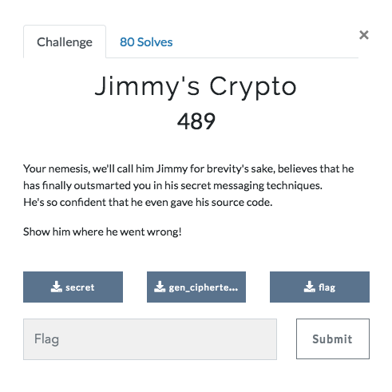

# Jimmy's Crypto (Crypto 489 points)




## Exploring the Source code
```
#!/usr/bin/env python2

import random

def do_xor(p, k):
	out = ''
	for i in xrange(len(p)):
		out += chr(ord(p[i]) ^ ord(k[i]))
	return out


with open('flag_plaintext', 'rb') as f1:
	p1 = ''.join(f1.readlines())

with open('secret_plaintext', 'rb') as f2:
	p2 = ''.join(f2.readlines())

l = max(len(p1), len(p2))

key = ''.join([chr(random.randint(0, 256)) for i in xrange(l)])

c1 = do_xor(p1, key)
c2 = do_xor(p2, key)

with open('flag', 'wb') as f1:
	f1.write(c1)

with open('secret', 'wb') as f2:
	f2.write(c2)

```
It looks like both the flag and the secret are being XORed with the same random key and writing the output into the flag and the secret files respectively.

## Cracking the encryption
If we are using XOR as a ONE TIME PAD (unique key for each message), then it is virtually uncrackable. But here the same key has been used for two messages and we know a piece of the flag("TUCTF{"). That means we can try to get the full flag using a known plaintext attack against it. First let us find out the length of the flag and the key.
```
len(flag) = 109
len(secret) = 376    ===> len(key) = max(109,376) = 376
```
Since the length of the key is more than the length of flag, repeating key is ruled out.

It should be safe to assume that the secret is a valid ascii meaningful message.
First we need to findout the part of the secret which is at the same position of the known part of the flag. For that, I used the below script.
```
def do_xor(p, k):
  out = ''
  for i in xrange(len(p)):
    out += chr(ord(p[i]) ^ ord(k[i]))
  return out

flagenc = open("flag","r").read()
secretenc = open("secret","r").read()
flagxorsecret = do_xor(flagenc,secretenc)
flagpart = "TUCTF{"
def is_printable(s):
  return all(ord(c) >= 32 and ord(c) <= 126 for c in s)

for i in range(len(flagxorsecret)):
  if(is_printable(do_xor(flagxorsecret[i:i+len(flagpart)],flagpart))):
    print i
    print do_xor(flagxorsecret[i:i+len(flagpart)],flagpart)
```
Output is
```
0
~DERFz
1
ESETGi
2
RSCUT-
8
PURT@g
9
TDCRZ>
42
teal m     <------------ Our Wanted Piece
43
dw{2PF
44
vm%B{k
45
l3UiVF
46
2C~D{J
47
BhSiwG
48
iE~ez\
49
DhrhaM
57
.=9m56
107
s0
108
1
```
From now on, its mostly guesswork. By guessing, we get the flag and the corresponding secret as
```
TUCTF{D0NT_US3_TH3_S4M3_K3Y_F0R_TH3_S4M3_M3SS4G3}
teal my secrets. If you are looking at this file,
```
## References
* https://en.wikipedia.org/wiki/One-time_pad
