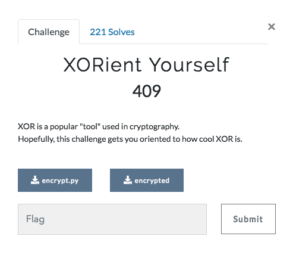

# XORient Yourself



## Exploring the Source code
```
#!/usr/bin/env python2

def xor(msg, key):
    o = ''
    for i in range(len(msg)):
        o += chr(ord(msg[i]) ^ ord(key[i % len(key)]))
    return o

with open('message', 'r') as f:
    msg = ''.join(f.readlines()).rstrip('\n')

with open('key', 'r') as k:
    key = ''.join(k.readlines()).rstrip('\n')

assert key.isalnum() and (len(key) == 9)
assert 'TUCTF' in msg

with open('encrypted', 'w') as fo:
    fo.write(xor(msg, key))

```

We know that TUCTF{ is a part of the message. We can use that to get the full flag.
```
def xor(msg, key):
    o = ''
    for i in range(len(msg)):
        o += chr(ord(msg[i]) ^ ord(key[i % len(key)]))
    return o

flagpart="TUCTF{"
flagenc = open("encrypted","r").read()
for i in range(len(flagenc)):
  if(xor(flagenc[i:i+len(flagpart)],flagpart).isalnum()):
    print i
    print xor(flagenc[i:i+len(flagpart)],flagpart)
```
Output is
```
0
Duax5A
2
vy0nfA
13
bxftsJ
14
ypcawZ
15
quvegN
42
wvjbnL
51
hshblM
67
r6cicF
71
qhbrjL
106
bvni4T
117
XORISC    <----------- String contains XOR, maybe a part of the key?
129
BP3IPh
144
SYCDEl
151
f
```

Now we know a part of the key also, we can use this to brute force the remaining three characters of the key and get the flag
```
Key: XORISCOOL
Message: Hope you are enjoying TUCTF! This is a challenge designed to get you oriented with how XOR works.\n\nHere's your flag: TUCTF{XOR_1$_V3RY_U$3FUL_T0_CRYPT0}
Flag: TUCTF{XOR_1$_V3RY_U$3FUL_T0_CRYPT0}
```
