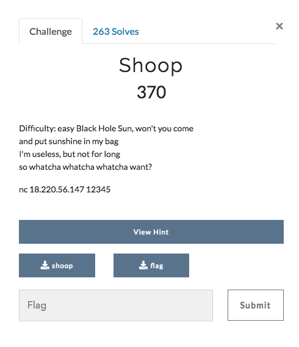
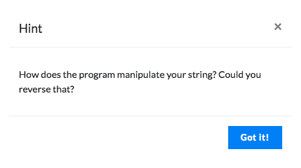

## Shoop (Reversing 370 points)





The hint suggests that we need to reverse a string manipulation process. Lets get and look at the decompiled source code. The binary can be decompiled using RetDec Decompiler(Open Source) or IDA Pro (Licensed)

## Exploring the decompiled source code

```
int __cdecl main(int argc, const char **argv, const char **envp)
{
  _BYTE *src; // [sp+10h] [bp-20h]@1
  void *s; // [sp+18h] [bp-18h]@1
  signed int k; // [sp+24h] [bp-Ch]@7
  signed int j; // [sp+28h] [bp-8h]@4
  signed int i; // [sp+2Ch] [bp-4h]@1

  setvbuf(_bss_start, 0LL, 2, 0x14uLL);
  setvbuf(stdin, 0LL, 2, 0x14uLL);
  s = malloc(0x16uLL);
  memset(s, 0, 0x16uLL);
  printf("Gimme that good stuff: ", 0LL);
  read(0, s, 0x15uLL);
  src = malloc(0x15uLL);
  for ( i = 20; i >= 0; --i )
    src[21 - i - 1] = *((_BYTE *)s + i);
  memcpy(s, src, 0x15uLL);
  for ( j = 0; j < 21; ++j )
    *((_BYTE *)s + j) -= 5;
  for ( k = 0; k < 21; ++k )
    src[k] = *((_BYTE *)s + (k + 10) % 21);
  memcpy(s, src, 0x15uLL);
  printf("Survey Says! %s\n", s);
  if ( !memcmp(s, "jmt_j]tm`q`t_j]mpjtf^", 0x15uLL) )
  {
    puts("That's right!");
    system("/bin/cat ./flag");
  }
  else
  {
    puts("Close... probably");
  }
  return 0;
}

```
From the source code, we can understand that our input string goes through three steps.
1. String Reversal
2. Caesar Cipher
3. String Jumble

So to reverse this, we just need to reverse each step on the output
```
output = "jmt_j]tm`q`t_j]mpjtf^"
outputcode = [ord(i) for i in output]
inputcode = ["0"] * 21
for i in range(21):
  inputcode[i] = outputcode[((11 + i) % 21)]

inputcode = [i+5 for i in inputcode]
inputcode = inputcode[::-1]
print "".join([chr(i) for i in inputcode])
```
You get the key as "everybodyrockyourbody" and providing that gives the flag
