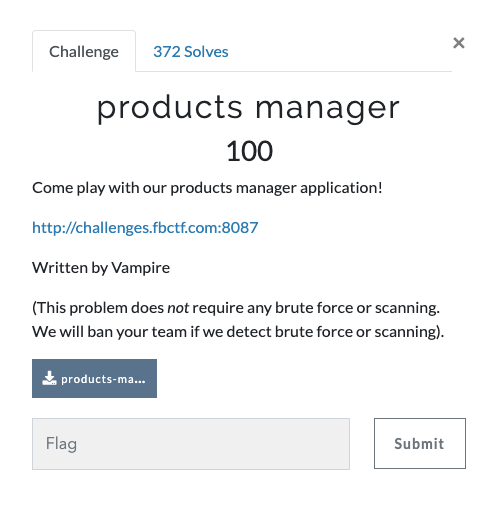
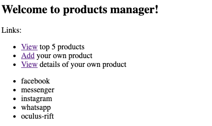
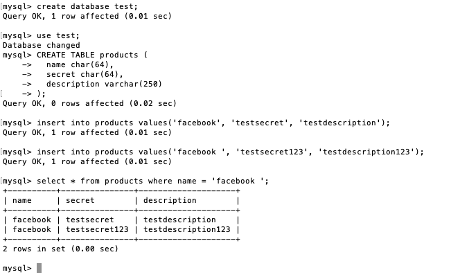
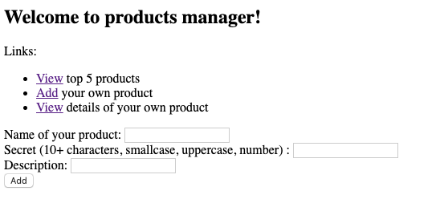
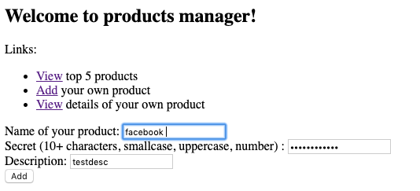
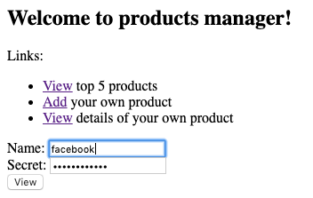
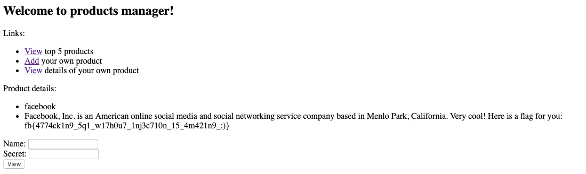

# Products Manager (Web 100 points)



Source Code in [source](source) directory

## Home Page



The homepage shows the top 5 products present in the database. We see that there are two other options to add a new product and view any product using the product's name and secret.

## Source Code
Lets take a look at the source code. We find an interesting line in db.php
```
$db = new mysqli($MYSQL_HOST, $MYSQL_USERNAME, $MYSQL_PASSWORD, $MYSQL_DBNAME);
```
Point to note is that the backend uses MYSQL.

```
$statement = $db->prepare(
  "SELECT name, description FROM products WHERE name = ?"
);
```
In the db.php file, we also see that prepared statements are being used. That means sql injection cannot be done. The flag is present in the description of the facebook product.

But 1 important thing to remember when using mysql is that mysql ignores <strong>trailing whitespaces </strong> when querying.

Checkout the example in the image below



Even the results without the trailing space are being included. We will be using this to our advantage.

## Add Product



Add a trailing space to the name of the product so it gets inserted.



The product will be successfully added.

## View Product



You can use the secret used to create the above new product to get the flag.


