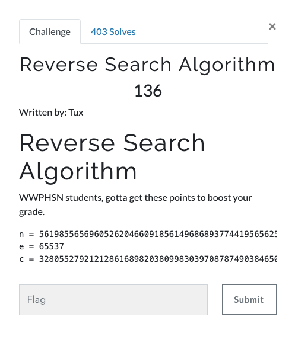
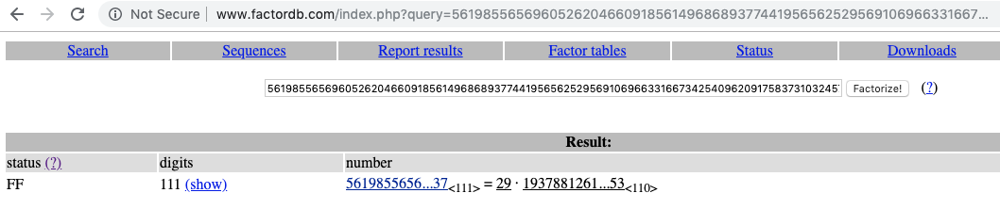

# Reverse Search Algorithm (Crypto 136 points)



The name Reverse Search Algorithm is just another way of saying RSA cryptosystem.

For more information about RSA, refer [RSA](https://en.wikipedia.org/wiki/RSA_(cryptosystem).

We are given the public key, public exponent and the encrypted message.

```
n = 561985565696052620466091856149686893774419565625295691069663316673425409620917583731032457879432617979438142137
e = 65537
c = 328055279212128616898203809983039708787490384650725890748576927208883055381430000756624369636820903704775835777
```
Since for decrypting RSA we need to factorize the public key, lets try factorizing it using factordb.



It gives us the factors of the public key. We can decrypt the encrypted message using these factors.

```
vagrant@ubuntu-xenial:~$ python
Python 2.7.12 (default, Nov 12 2018, 14:36:49)
[GCC 5.4.0 20160609] on linux2
Type "help", "copyright", "credits" or "license" for more information.
>>> import gmpy
>>> import libnum
>>> n = 561985565696052620466091856149686893774419565625295691069663316673425409620917583731032457879432617979438142137
>>> e = 65537
>>> c = 328055279212128616898203809983039708787490384650725890748576927208883055381430000756624369636820903704775835777
>>> p = 29
>>> q = 19378812610208711050554891591368513578428260883630885898953907471497427917962675301070084754463193723428901453
>>> assert n == p * q
>>> phi = (p-1)*(q-1)
>>> d = int(gmpy.invert(e,phi))
>>> libnum.n2s(pow(c,d,n))
'hsctf{y3s_rsa_1s_s0lved_10823704961253}'
>>>
```
