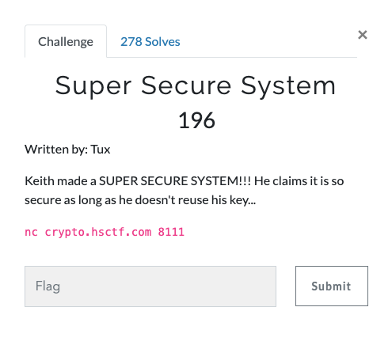

# Super Secure System (Crypto 196 points)



```
vagrant@ubuntu-xenial:~$ nc crypto.hsctf.com 8111
* * * SUPER SECURE SYSTEM * * *
My encryption system is impossible to crack if used once!
You can use this system to encrypt any of your messages with my super special key!!!
Here is my super secret message: 0a584846152d2e1d1c191c7e183b030f3e222f265001490b3a5c363d15032c41141a5e2f71501a33347808250b5c4f05490f3f012e

Enter the message you want to encrypt: a

Encrypted: 03

Time out!
vagrant@ubuntu-xenial:~$
```

Super Secure System suggests that the encryption used is One time pad(XOR) since the key is never reused in it(and it is considered a very secure system).

But over here, once the session is started, the same key is used throughout the session.

We can brute force each character to match the encrypted flag after xoring.

This [script](crack.py) does that for us.
