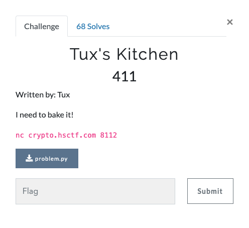

# Tux's Kitchen (Crypto 411 points)



## Source Code

This is the main part which generates the ciphertext
```
key = bake_it()
print(final_baking(flag,key))
```

Bake It - Generates a random number
```
def bake_it():
	s = 0
	for i in range(random.randint(10000,99999)):
		s = random.randint(100000000000,999999999999)
	s -= random.randint(232,24895235)
	return random.randint(100000000000,999999999999)
```

Final Baking
```
def final_baking(food,key):
	baked = rand0m_mess(food,key)
	treasure = []
	for i in range(len(baked)):
		treasure.append(ord(food[i])*baked[i])
	treasure = prepare(treasure)
	return treasure
```

Random Mess
```
def rand0m_mess(food,key):
	mess = []
	mess.append(key)
	art = key
	bart = bake_it()
	cart = bake_it()
	dart = bake_it()
	for i in range(len(food)-1):
		art = (art*bart+cart)%dart
		mess.append(art)
	return mess
```

Prepare
```
def prepare(food):
	good_food = []
	for i in range(len(food)):
		good_food.append(food[i]^MY_LUCKY_NUMBER)
	for k in range(len(good_food)):
		good_food[i] += MY_LUCKY_NUMBER
	return good_food
```

If we closely look at the final_baking function, we can see that before calling prepare(treasure) method, the treasure list is made by appending ord(food[i])\*baked[i] for each i. That means, at that point of time, irrespective of the value of baked[i], each element in the treasure list would be divisible by the corresponding value of the character at the same index in the flag string.

All we need to do to achieve that state is to reverse the prepare(food) function. This is done in the [crack.py](crack.py) script.

The first 4 lists defined in the script are 4 results which were retrieved by connecting to the given remote server. Multiple datasets are required here because each number in the list can have multiple characters whose ascii indexes divide them perfectly.

From the output printed by the script, a little bit of guessing work is involved to get the actual flag.

Output of the script is
```
Possible characters for 0:  ['h', '4']
Possible characters for 1:  ['s']
Possible characters for 2:  ['c']
Possible characters for 3:  ['t']
Possible characters for 4:  ['3', 'D', 'f']
Possible characters for 5:  ['{']
Possible characters for 6:  ['t']
Possible characters for 7:  ['h', '4']
Possible characters for 8:  ['i']
Possible characters for 9:  ['i']
Possible characters for 10:  ['i']
Possible characters for 11:  ['1']
Possible characters for 12:  ['1', 'b']
Possible characters for 13:  ['1']
Possible characters for 14:  ['i']
Possible characters for 15:  ['i']
Possible characters for 16:  ['i', 'F']
Possible characters for 17:  ['s']
Possible characters for 18:  ['s']
Possible characters for 19:  ['_']
Possible characters for 20:  ['i', 'F']
Possible characters for 21:  ['s']
Possible characters for 22:  ['s']
Possible characters for 23:  ['s']
Possible characters for 24:  ['s']
Possible characters for 25:  ['s']
Possible characters for 26:  ['_']
Possible characters for 27:  ['y']
Possible characters for 28:  ['o']
Possible characters for 29:  ['0']
Possible characters for 30:  ['u']
Possible characters for 31:  ['9', 'r']
Possible characters for 32:  ['_']
Possible characters for 33:  ['1', 'b']
Possible characters for 34:  ['1', 'b']
Possible characters for 35:  ['9', 'r']
Possible characters for 36:  ['t']
Possible characters for 37:  ['h', '4']
Possible characters for 38:  ['2', 'd']
Possible characters for 39:  ['4']
Possible characters for 40:  ['y']
Possible characters for 41:  ['_']
Possible characters for 42:  ['s']
Possible characters for 43:  ['0']
Possible characters for 44:  ['7', 'n']
Possible characters for 45:  ['g']
Possible characters for 46:  ['_']
Possible characters for 47:  ['i']
Possible characters for 48:  ['t']
Possible characters for 49:  ['_']
Possible characters for 50:  ['i']
Possible characters for 51:  ['s']
Possible characters for 52:  ['7', 'n']
Possible characters for 53:  ['t']
Possible characters for 54:  ['_']
Possible characters for 55:  ['v']
Possible characters for 56:  ['e']
Possible characters for 57:  ['9', 'r']
Possible characters for 58:  ['y']
Possible characters for 59:  ['_']
Possible characters for 60:  ['l', '6']
Possible characters for 61:  ['o']
Possible characters for 62:  ['7', 'n']
Possible characters for 63:  ['g']
Possible characters for 64:  ['_']
Possible characters for 65:  ['6']
Possible characters for 66:  ['6']
Possible characters for 67:  ['2']
Possible characters for 68:  ['1']
Possible characters for 69:  ['}']
Possible characters for 70:  []
```

From this, we can deduce the flag as
```
hsctf{thiii111iiiss_isssss_yo0ur_b1rthd4y_s0ng_it_isnt_very_long_6621}
```
