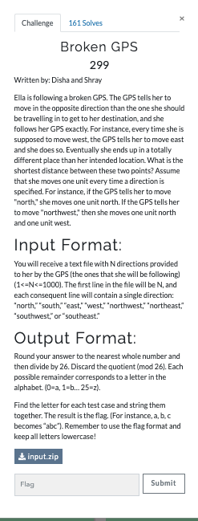

# Broken GPS (Misc 299 points)

    

We are given a [zip](input.zip) file containing the text files with directions.

On unzipping it, we get 12 files containing directions.

Lets consider the road Ella is following is the X-Y plane and the starting point is the origin(0,0).

Since Ella always moves in the opposite direction the GPS shows, if the actual destination is (x,y) the place she would have reached is (-x,-y). So we need to find the distance between these two points.

This [script](crack.py) does that for us and gives the flag.
Unzip the given file before running the script.
