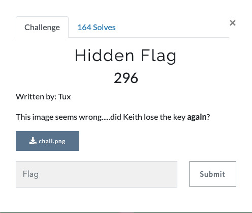

# Hidden Flag (Misc 296 points)



We are given an [image](chall.png).

Lets see what type of file it is.
```
vagrant@ubuntu-xenial:~$ file chall.png
chall.png: data
vagrant@ubuntu-xenial:~$
```

It is named with .png but it's headers don't match png format. Maybe the file is encrypted.

Lets see for any embedded strings in it.

```
vagrant@ubuntu-xenial:~$ strings chall.png
..
..
key is invisible
vagrant@ubuntu-xenial:~$
```
It says "key is invisible". Maybe the file is encrypted with the key "invisible".

Lets try XOR first.

```
infile = "chall.png"
outfile = "dec.png"

key = "invisible"

s = open(infile, "r").read()
p = ""
for i in range(len(s)):
	p += chr(ord(s[i]) ^ ord(key[i%len(key)]))

open(outfile, "w").write(p)
```
```
vagrant@ubuntu-xenial:~$ file dec.png
dec.png: PNG image data, 665 x 268, 8-bit/color RGB, non-interlaced
vagrant@ubuntu-xenial:~$
```
After decrypting the original file, we got a png. Lets open it and check.


There is our flag.
