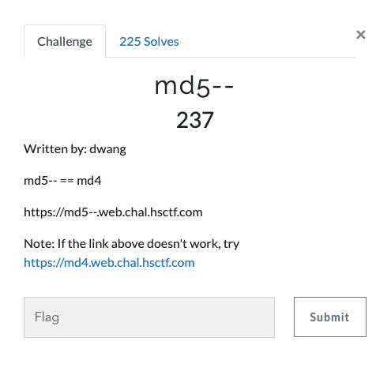

# MD5-- (Web 237 points)



## Source code

```
<?php
$flag = file_get_contents("/flag");

if (!isset($_GET["md4"]))
{
    highlight_file(__FILE__);
    die();
}

if ($_GET["md4"] == hash("md4", $_GET["md4"]))
{
    echo $flag;
}
else
{
    echo "bad";
}
?>
```

This piece of code is checking for a string whose md4 hash is equal to itself.

But one more thing that needs to be observed here is the usage of "==" instead of "===".

This means php type juggling is possible.

The code is available [here](crack.py)

## References
1) https://github.com/bl4de/ctf/blob/master/2017/HackDatKiwi_CTF_2017/md5games1/md5games1.md
