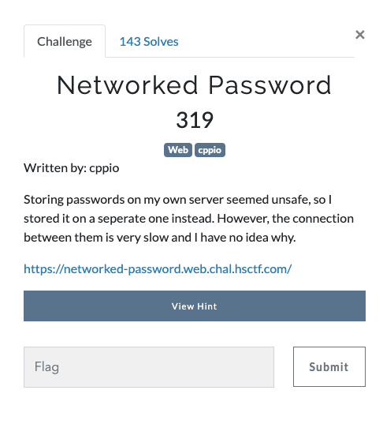
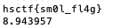

# Networked Password (Web 319 points)

This challenge can be solved using a time based attack. If you observe, when a correct character of the flag is submitted as a password, the response time increases. We can use this to brute force for the flag.

Source: [crack.py](crack.py)

Flag:

